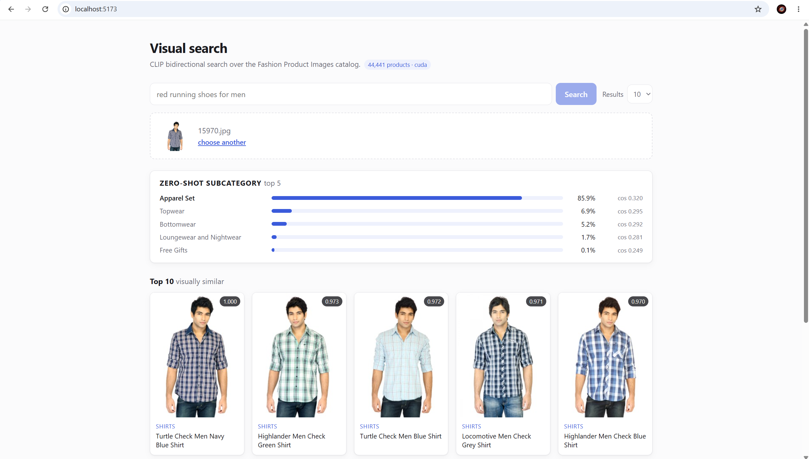
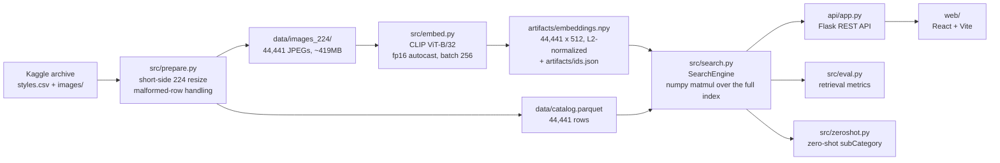

# Visual-Language E-commerce Search

Bidirectional image/text product search over the Kaggle [Fashion Product Images
dataset](https://www.kaggle.com/datasets/paramaggarwal/fashion-product-images-dataset)
(44,441 products), built on
[openai/clip-vit-base-patch32](https://huggingface.co/openai/clip-vit-base-patch32).
Every catalog image is encoded once into a 512-d L2-normalized CLIP embedding, so
the whole index is a 44,441 x 512 float32 array (~87MB) that lives in RAM;
searching is one CLIP encode of the query plus one numpy matmul, and similarity
is a plain dot product. From that single index the system answers text -> image
search, image -> image similarity, image -> text caption ranking, and zero-shot
`subCategory` classification against 45 label prompt ensembles. No FAISS, no
vector database, no fine-tuning: the interesting engineering is in matching the
checkpoint's preprocessing exactly, in defining the retrieval metrics so the
numbers mean something, and in stating an honest baseline next to every one of
them.



## Pipeline



`prepare` and `embed` run once; `search` is a library that `api`, `eval` and
`zeroshot` all import, so the API, the metrics and the classifier can never
drift apart on preprocessing, checkpoint or precision.

## Results

Two things are measured, and they are not the same task:

- **articleType retrieval is category-level.** A result counts as relevant if it
  shares the query product's `articleType` ("Tshirts", "Sports Shoes"). The mean
  query has 2,355 relevant items out of 44,440, so this measures whether CLIP
  lands in the right product category.
- **strict retrieval is instance-level.** Only the query product itself counts,
  by exact id. There is exactly one relevant item out of 44,441, so this measures
  whether CLIP finds one specific product from its own product name.

Category-level numbers are high and instance-level numbers are low for the same
index and the same embeddings. Neither is the "real" score; they answer different
questions, and both are printed with the closed-form expectation of the same
metric under a uniformly random ranking so the lift is visible rather than
implied.

All tables below are the verbatim output of `python -m src.eval --mode both` and
`python -m src.zeroshot` on the full 44,441-product index.

### articleType retrieval (category-level), text -> image

```
definitions
  query text    space-joined gender, baseColour, articleType, usage of the
                query product, skipping absent attributes
  relevant      any result sharing the query product's articleType
  top-k hit     at least one of the top k results is relevant
  MRR           mean of 1/(rank of first relevant result); a query
                with no relevant item contributes 0
  ranked over   44,440 products, query product excluded
  sample        1000 products, default_rng(seed)

relevant items per query: min 3, median 1758, max 7068 (mean 2354.8 of 44,440)

metric           CLIP     random      lift
top-1          0.7340     0.0530     13.9x
top-5          0.9300     0.2163      4.3x
MRR            0.8187     0.1453      5.6x
median rank of first relevant result: 1
```

The random baseline is high (0.2163 at top-5) precisely because `articleType` is
coarse — with a mean of 2,355 relevant items in the pool, random ranking hits one
often. The honest headline is therefore **4.3x lift at top-5**, not "0.93". The
query product is excluded from its own results, since its own image would
otherwise be a free top-1 hit; `--include-self` moves each number by about
+0.002.

### strict retrieval (instance-level), text -> image

```
definitions
  query text    the product's productDisplayName, verbatim
  relevant      only the query product itself (exact id match)
  R@k           the query product appears in the top k results
  MRR           mean of 1/(rank of the query product)
  ranked over   all 44,441 products, query product included
  sample        1000 products, default_rng(seed)

metric           CLIP     random      lift
R@1            0.0440   2.25e-05     1955x
R@5            0.1190   1.13e-04     1058x
R@10           0.1820   2.25e-04      809x
MRR            0.0925   2.54e-04      365x
median rank of the query product: 82
```

R@1 of 0.0440 against a random baseline of 2.25e-05 is a 1955x lift, and the
median rank of the target product is 82 of 44,441. Part of the remaining gap is
unreachable: 18,413 of 44,441 rows share a `productDisplayName` with another row,
so exact-id relevance is partly undefined from text alone. `eval.py` prints the
widened diagnostic below to separate label ambiguity from genuine retrieval
failure. **It is a diagnostic, not the strict metric** — the strict numbers are
the ones above.

```
ceiling: 18,413 of 44,441 catalog rows share their
productDisplayName with another row, so exact-id relevance is partly
unreachable from text alone. Widening relevance to any product with an
identical productDisplayName (diagnostic, NOT the strict metric):

metric           CLIP     random      lift
R@1            0.0750   7.61e-05      985x
R@5            0.1810   3.80e-04      476x
R@10           0.2780   7.60e-04      366x
MRR            0.1397   6.77e-04      206x
median rank of the first identical-name product: 40
```

### strict retrieval (instance-level), image -> text

```
definitions
  query         the product's image, preprocessed exactly as in
                src.embed (SearchEngine.encode_image)
  candidates    the 1000 sampled productDisplayNames (979 distinct)
  relevant      only the caption of the query product itself
  R@k           that caption appears in the top k
  MRR           mean of 1/(rank of that caption)
  ranked over   the 1000-caption pool
  sample        1000 products, default_rng(seed)

metric           CLIP     random      lift
R@1            0.3470   1.00e-03      347x
R@5            0.6630     0.0050      133x
MRR            0.4929     0.0075     65.9x
median rank of the query caption: 3
```

This direction is easier than instance-level text -> image only because the
candidate pool is 1,000 captions rather than 44,441 products; the random baseline
of 1.00e-03 states that pool size explicitly. `eval.py` also verifies
`image_to_text()` against a batched matmul on one product and reports the
per-candidate score delta (1.03e-04, fp16 batch-size sensitivity in the image
encoder, not a preprocessing difference).

### Zero-shot subCategory classification

45 labels, all 44,441 products. A label vector is the re-normalized mean of its
prompt embeddings; the prediction is the argmax cosine. Two prompt variants are
always reported, so the effect of handling the dataset's jargon label names is
measured rather than asserted. The baseline is the majority class.

**plain** — the label string, lowercased, through 5 templates (225 prompts):

```
definitions
  task                assign each product one of 45 subCategory labels
  prediction          argmax over labels of (label vector . image
                      embedding); both are L2-normalized, so it is cosine
  label vector        mean of its prompt embeddings, re-normalized
  prompts             225 total, 5 templates x each label's surface forms
  surface forms       the label lowercased
  overall accuracy    correct / all products
  macro accuracy      unweighted mean of per-class accuracy, where
                      per-class accuracy = recall = correct_c / support_c
  majority baseline   always predict 'Topwear' (15,401 of 44,441)

metric                    CLIP   majority     lift
overall accuracy        0.6504     0.3465    1.88x
macro accuracy          0.5149     0.0222   23.17x

products 44,441   correct 28,904   classes with support 45
```

**expanded** — `LABEL_SURFACES` natural-language phrasings through the same
templates (415 prompts):

```
definitions
  task                assign each product one of 45 subCategory labels
  prediction          argmax over labels of (label vector . image
                      embedding); both are L2-normalized, so it is cosine
  label vector        mean of its prompt embeddings, re-normalized
  prompts             415 total, 5 templates x each label's surface forms
  surface forms       LABEL_SURFACES phrasings (see module docstring)
  overall accuracy    correct / all products
  macro accuracy      unweighted mean of per-class accuracy, where
                      per-class accuracy = recall = correct_c / support_c
  majority baseline   always predict 'Topwear' (15,401 of 44,441)

metric                    CLIP   majority     lift
overall accuracy        0.6835     0.3465    1.97x
macro accuracy          0.6238     0.0222   28.07x

products 44,441   correct 30,374   classes with support 45
```

**effect of the surface forms:**

```
metric                   plain   expanded     delta
overall accuracy        0.6504     0.6835   +0.0331
macro accuracy          0.5149     0.6238   +0.1089

10 classes most changed by the surface forms
  class                      support    plain  expanded    delta
  Home Furnishing                  1   0.0000    1.0000  +1.0000
  Apparel Set                    106   0.0377    0.8208  +0.7830
  Lips                           527   0.1537    0.8159  +0.6622
  Bottomwear                    2693   0.2165    0.8645  +0.6480
  Accessories                    143   0.0280    0.5944  +0.5664
  Eyes                            43   0.0000    0.4884  +0.4884
  Nails                          329   0.5289    0.9058  +0.3769
  Hair                            19   0.6316    1.0000  +0.3684
  Sports Equipment                21   0.6667    1.0000  +0.3333
  Perfumes                         6   0.0000    0.3333  +0.3333

collapsed under plain only (recovered): Bath and Body, Eyes, Home Furnishing, Perfumes, Skin, Stoles
collapsed under expanded only (new):    Sports Accessories
collapsed under both:                   Beauty Accessories, Free Gifts, Mufflers, Vouchers, Wristbands
```

Note the macro gain (+0.1089) is three times the overall gain (+0.0331): the
surface forms mostly rescue small and mid-sized classes whose label names are
warehouse jargon ("Lips" is 315 lipsticks and 144 lip glosses, so "lipstick" is
the truer prompt), which barely moves the product-weighted number. Five classes
collapse under both variants; see the engineering note below for which of those
are CLIP's fault and which are the dataset's.

## Setup

PowerShell, Windows. Python 3.11, Node 26.

```powershell
git clone <repo-url> C:\dev\visual-search
cd C:\dev\visual-search

py -3.11 -m venv .venv
.\.venv\Scripts\Activate.ps1
python -m pip install --upgrade pip

# CUDA wheels for torch/torchvision come from the PyTorch index, not PyPI.
pip install torch==2.13.0+cu126 torchvision==0.28.0+cu126 `
  --index-url https://download.pytorch.org/whl/cu126
pip install -r requirements.txt

python -c "import torch; print(torch.__version__, torch.cuda.is_available())"
```

Download the dataset. This needs a Kaggle API token at
`$env:USERPROFILE\.kaggle\kaggle.json` (Kaggle -> Settings -> Create New Token).
The full-resolution archive is large; it extracts to `data\fashion-dataset\`.

```powershell
New-Item -ItemType Directory -Force data | Out-Null
kaggle datasets download -d paramaggarwal/fashion-product-images-dataset `
  -p data --unzip

# src\prepare.py expects exactly these two paths:
Test-Path data\fashion-dataset\styles.csv
Test-Path data\fashion-dataset\images
```

Build the catalog and the index. Both scripts take `--limit` and write limited
runs to separate files, so a smoke test cannot truncate the real artifacts.

```powershell
python -m src.prepare --dry-run          # parse the CSV, report counts, write nothing
python -m src.prepare --limit 200        # -> data\catalog.limit200.parquet
python -m src.prepare                    # -> data\images_224\, data\catalog.parquet

python -m src.embed --limit 256          # -> artifacts\embeddings.limit256.npy
python -m src.embed                      # -> artifacts\embeddings.npy, artifacts\ids.json
```

`prepare` reports how many rows it dropped and why: `styles.csv` has malformed
rows with unescaped commas in `productDisplayName`, and rows are also dropped for
an unparseable id, a duplicate id, or an image missing from disk. The full encode
runs 44,441 images in 45.8s (970 img/s including image loading) at batch 256,
peak 1114MB allocated / 1314MB reserved on an RTX 4060 Laptop. On CUDA OOM the
batch halves and retries; it never falls back to CPU silently.

Once `data\images_224\` and `artifacts\` exist, `data\fashion-dataset\` can be
deleted — nothing downstream reads the raw archive.

Run the stack. The API loads the index, the catalog and the CLIP checkpoint once
at import, so start it before the frontend.

```powershell
# Terminal 1
.\.venv\Scripts\Activate.ps1
python -m api.app                        # http://127.0.0.1:5000

# Terminal 2
cd web
npm install
npm run dev                              # http://localhost:5173
```

`flask --app api.app run --debug` also works, but the reloader imports the module
twice and so loads the index twice; `python -m api.app` loads it once. For a fast
startup, `python -m api.app --limit 2000` indexes only the first 2,000 products.
The frontend reads the API URL from `VITE_API_URL` and defaults to
`http://127.0.0.1:5000`.

## Reproducing the numbers

Every number in this README comes from one of these four commands. Each prints
its own metric definitions and baselines next to the numbers.

```powershell
.\.venv\Scripts\Activate.ps1

python -m src.eval --mode both       # all three retrieval tables, 3.7 s
python -m src.zeroshot               # both prompt variants + the delta table, 0.5 s
python -m src.crop_parity            # the center-crop parity and cost table
python -m src.search --text "red running shoes for women" -k 5   # spot check
```

`eval.py` and `zeroshot.py` sample with `numpy.default_rng(42)`; `eval.py` takes
`--seed` and `--sample-size` if you want a different draw. The retrieval and
zero-shot figures quoted above were produced by the two commands as written,
against `artifacts/embeddings.npy` built by `python -m src.embed`.

## API reference

Base URL `http://127.0.0.1:5000`. Every response is JSON, including errors, which
are `{"error": str, "status": int}`. `k` may be sent in the JSON body, as a form
field, or as a query-string parameter; it must be an integer in `[1, 50]`
(`"3.7"` and `3.7` are rejected, not floored). Uploads are capped at 10MB and
validated by decoding, not by filename or Content-Type. CORS is open to any
`localhost` / `127.0.0.1` port.

| Method | Path | Request | Response |
| --- | --- | --- | --- |
| `GET` | `/health` | — | `status`, `index_size`, `embedding_dim`, `device`, `device_name`, `model`, `label_column`, `n_labels`, `n_label_prompts`, `images_dir_present`, `limits` |
| `POST` | `/search/text` | JSON `{"query": str, "k": int}`, `query` 1–500 chars, `k` default 10 | `{query, k, count, results[]}` — text -> image |
| `POST` | `/search/image` | `multipart/form-data`, image in field `file` (or `image`), optional `k`, default 10 | `{filename, k, count, results[]}` — image -> image |
| `POST` | `/classify` | `multipart/form-data`, image in field `file`, optional `k`, default 5, capped at 45 | `{filename, label_column, k, predictions[]}` — zero-shot subCategory |
| `GET` | `/images/<id>.jpg` | — | the JPEG from `data/images_224/`, `Cache-Control: max-age=86400` |

Each entry in `results[]`:

```json
{
  "id": 15970,
  "score": 0.973142,
  "image_url": "http://127.0.0.1:5000/images/15970.jpg",
  "articleType": "Shirts",
  "subCategory": "Topwear",
  "baseColour": "Navy Blue",
  "gender": "Men",
  "productDisplayName": "Turtle Check Men Navy Blue Shirt"
}
```

Each entry in `predictions[]` carries both the raw cosine and a probability, the
softmax over all 45 labels after scaling by CLIP's learned temperature
(`exp(logit_scale)` ~= 100) — cosines sit in a narrow band, so an unscaled
softmax would be meaningless:

```json
{ "label": "Apparel Set", "score": 0.320148, "probability": 0.859312 }
```

Environment variables, for the `flask` CLI which cannot take the script's flags:
`VISUAL_SEARCH_LIMIT` (index only the first N rows) and `VISUAL_SEARCH_DEVICE`
(`cuda` or `cpu`).

Concurrency: the dev server is threaded, but encode calls are serialized behind a
lock. One CLIP model on one GPU is not a shared-nothing resource, and interleaved
autocast batches are not worth the throughput.

## Engineering notes

### The center-crop offset has to floor, not round

`CLIPImageProcessor` center-crops at floor offsets, `(size - crop) // 2`.
`torchvision.transforms.CenterCrop` rounds. They disagree by one pixel whenever
`size - crop` is odd — and after a short-side-224 resize this dataset is almost
entirely 224x299, where `299 - 224 = 75` is odd. On the fixed 1000-image sample,
999 of 1000 images have an odd difference, so using `CenterCrop` would shift
nearly every image in the index one pixel off the crop the checkpoint expects.

Nothing about this fails loudly: the images look identical, no exception is
raised, and the embeddings are still unit vectors that still retrieve plausible
neighbours. It is only visible if you measure it. `python -m src.crop_parity`
does, on the same fp16 encode path `src/embed.py` uses:

```
sample:   1000 images, seed 42, device cuda
model:    openai/clip-vit-base-patch32
offsets:  999 of 1000 images have an odd size-crop difference, so floor and round pick different pixels

==========================================================================
PARITY  |  transform vs CLIPImageProcessor (256 images)
==========================================================================
transform                     max |pixel diff|   mean cosine       min
build_transform (floor)                 0.0000        1.0000    1.0000
CenterCrop (round)                      3.4668        0.9955    0.9402

==========================================================================
COST  |  round-offset vs floor-offset embeddings (1000 images)
==========================================================================
per-image cosine between the two embeddings of the same image
  mean     0.9957
  p0       0.9400
  p0.5     0.9719
  p1       0.9817
  p5       0.9898
  p25      0.9950
  p50      0.9968
  below 0.99   56 of 1000 images
```

`src.embed.build_transform` is pixel-exact against the real processor (max
absolute pixel difference 0.0000, cosine 1.0000), which is the point of writing
the crop by hand instead of using `CenterCrop`: the transform has to run inside
DataLoader workers, so it is reimplemented, and a reimplementation is only safe
if it is checked against the original. The rounding version costs mean cosine
**0.9957** against the correct embedding, with a tail that matters more than the
mean: 56 of 1000 images fall below 0.99, the 0.5th percentile is **0.9719**, and
the worst image in the sample is **0.9400**. A one-pixel crop shift is a small
average perturbation applied to every single vector in the index, concentrated on
images whose subject sits near the crop boundary.

### The random baseline is closed form, not simulated

Every retrieval table carries the exact expectation of the same metric under a
uniformly random ranking, computed per query from that query's true number of
relevant items. For a pool of `n` items with `r` relevant, the probability that
the first relevant result falls after rank `k` is
`C(n - r, k) / C(n, k)`, evaluated in log space as a cumulative product; top-k
accuracy is `1 - P(R > k)` and MRR is `sum(pmf(rank) / rank)` over that
distribution. Nothing is sampled, so the baseline has no variance to argue about
and does not shift between runs.

This is what makes the two modes comparable. 0.9300 at top-5 sounds far better
than 0.1190 at R@5 until the baselines are put next to them — 0.2163 versus
1.13e-04 — at which point the instance-level task is visibly the harder one by
four orders of magnitude in pool difficulty, and the category-level 0.9300 is a
4.3x lift rather than a 7,800x one.

### productDisplayName duplication caps strict text -> image

18,413 of 44,441 catalog rows share their `productDisplayName` with at least one
other row. Under strict relevance — only the query product's exact id counts — a
query like "Nike Women Yellow T-shirt" cannot in principle be answered correctly
whenever several distinct ids carry that same name: the text simply does not
identify one product. So part of the 1 - 0.0440 miss rate at R@1 is not a
retrieval failure at all.

Rather than quietly redefine relevance to make the number look better, `eval.py`
reports both: the strict metric (R@1 0.0440, MRR 0.0925) and a widened diagnostic
that accepts any product with an identical name (R@1 0.0750, MRR 0.1397). The
diagnostic is roughly 1.7x the strict figure, which bounds how much of the gap is
label ambiguity versus genuine error — and it is labeled as a diagnostic
everywhere it appears, in the script output and in the Results section above,
because quoting it as the strict metric would be exactly the kind of silent
metric inflation the two-number split exists to prevent.

### Sports Accessories and Wristbands are the same class under two names

Five classes collapse to zero accuracy under both prompt variants: Beauty
Accessories, Free Gifts, Mufflers, Vouchers, Wristbands. Prompt engineering is
not the fix for all of them, and `zeroshot.py` prints the evidence that separates
the causes — the cosine between two labels' ensembled vectors, alongside the
Jaccard overlap of the `articleType` sets those two classes actually contain:

```
  pair                                              cosine  jaccard
  Sports Accessories / Wristbands                   0.9920     1.00  <- near-synonym
  Fragrance / Perfumes                              0.9530     0.33  <- near-synonym
```

`Sports Accessories / Wristbands` has cosine **0.9920** and articleType Jaccard
**1.00**. A Jaccard of 1.00 means the two classes' articleType sets are
identical: every product in either class has articleType "Wristbands". They are
one class labeled two ways, with supports of 3 and 4 products. No prompt can
separate them, because there is nothing to separate — the ceiling for this pair
is not CLIP's, it is the dataset's. `Fragrance / Perfumes` (cosine 0.9530,
Jaccard 0.33) is a milder version of the same defect; both classes are largely
"Perfume and Body Mist".

The contrast is `Mufflers -> Scarves`, which is a Jaccard of 0.00 — disjoint
articleType sets, genuinely different products — where all 38 Mufflers are
predicted as Scarves. That one is CLIP conflating two visually similar
categories, a real model limitation and a legitimate target for better prompts.
Reporting the cosine without the Jaccard would have made both look like the same
kind of failure.
